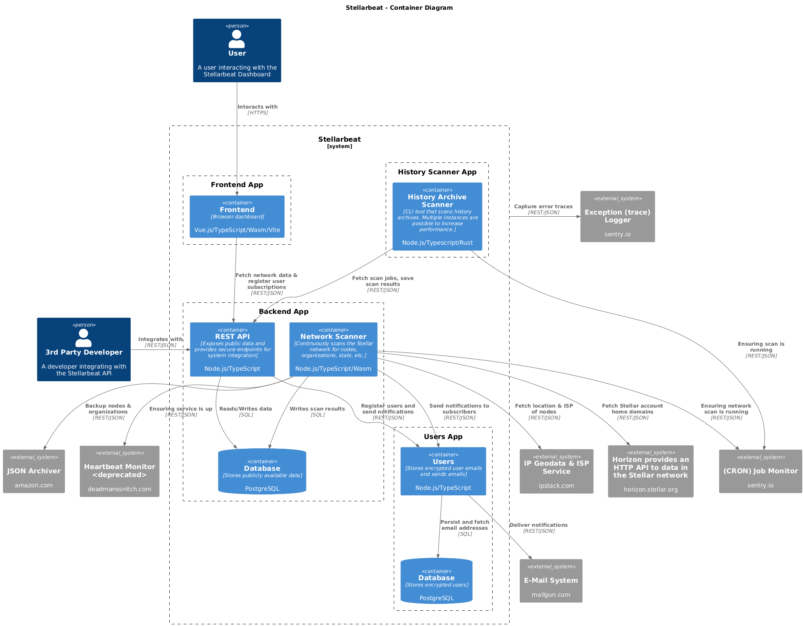

[](https://github.com/prettier/prettier)

# OBSRVR Radar (formerly Stellarbeat)

## About

OBSRVR Radar is a monitoring and analytics platform for the Stellar network and
its validators and organizations. It collects and visualizes network data with
the ability to time-travel, has simulation options, provides REST APIs for
integration, implements email notifications, scans validator history archives
for errors and provides educational tools to aid in understanding the Stellar
Consensus Protocol.

> **Note:** Formerly known as StellarBeat, the project is now in the care of OBSRVR, which continues to build on its solid foundation with updated branding and ongoing improvements.

## Architecture

This monorepo is organized into several main components:

### Apps

- **Backend** ([apps/backend](apps/backend/README.md)) - Core application with
  three major modules:

  - Network-scan: Collects and updates network data
  - Notifications: Handles user subscriptions and email notifications
  - History-scanner-coordinator: Determines scan schedule, persists and exposes
    scan results.

  Provides REST APIs documented using the OpenAPI standard.

- **Frontend** ([apps/frontend](apps/frontend/README.MD)) - Vue.js based web
  dashboard
- **Users** ([apps/users](apps/users/README.md)) - User email microservice

- \*\*History-scanner\*\*
  ([apps/history-scanner](apps/history-scanner/README.md)) - History Scanner
  microservice/worker

### Packages

- **Crawler** ([packages/crawler](packages/crawler/)) - Stellar network crawler
  that identifies nodes and determines their status
- **Shared** ([packages/shared](packages/shared/)) - Common code used by both
  frontend and backend, including DTO classes and TrustGraph calculations
- **SCP Simulation** ([packages/scp-simulation](packages/scp-simulation/)) -
  Educational implementation of the Stellar Consensus Protocol
- **Node Connector** ([packages/node-connector](packages/node-connector/)) -
  Nodejs package to connect to Stellar nodes
- - Various utility packages

### Apps communication

Backend, frontend and users share data through REST API's.

### Development

The project uses:

- Nodejs on the backend
- Vuejs on the frontend using Vite build system
- REST for API's
- TypeScript with unified configuration inherited from tsconfig.base.json
- pnpm for package management and monorepo setup
- Jest for testing
- ESLint for code quality
- Docker/Devcontainer support for development environments
- OpenAPI documentation

### Database

- PostgreSQL for data persistence
- Automatic migrations on first run (TypeORM)
- Separate test database instance for integration testing

### Deployment



Adheres to
[twelve factor app methodology](https://en.wikipedia.org/wiki/Twelve-Factor_App_methodology)
for easy deployment on Heroku.

For history scanning think carefully about network traffic and costs when
choosing a provider.

### CI/CD Pipeline

The project uses GitHub Actions for continuous integration and deployment. The workflow is defined in `.github/workflows/ci-cd.yml`. 

#### GitHub Environments

The CI/CD pipeline uses GitHub Environments to manage deployment environments:
- `obsrvr-radar-staging` - For staging deployments 
- `obsrvr-radar-integration` - For integration deployments
- `obsrvr-radar-production` - For production deployments

Each environment can have its own secrets, environment variables, and deployment protection rules.

#### Required Secrets

To ensure the CI/CD pipeline works correctly, the following secrets need to be added to your GitHub repository:

1. Repository Secrets (used by all environments):
   - `AWS_ACCESS_KEY_ID` - AWS access key with S3 permissions
   - `AWS_SECRET_ACCESS_KEY` - Corresponding AWS secret key
   - `AWS_REGION` - Region where your S3 bucket is located (e.g., "us-east-2")

2. Environment-specific Secrets:
   - `DIGITALOCEAN_ACCESS_TOKEN` - Your DigitalOcean API token
   - Environment Domains:
     - `STAGING_DOMAIN` - Domain for staging environment
     - `INTEGRATION_DOMAIN` - Domain for integration environment
     - `PRODUCTION_DOMAIN` - Domain for production environment

These secrets are used for Terraform state management, deploying to DigitalOcean, and configuring environment-specific settings.

## Devcontainer development

For easy development a devcontainer configuration is provided in the
.devcontainer folder: https://containers.dev/

You can develop on github codespaces or localy using vscode and devcontainers
extension.

A debian docker image with non-root user 'node' is used with nodejs and rust
support. Two postgress databases are added for development and integration
testing. A persistant volume is created linked to the remote 'workspace' folder.

Also works with podman.

Container config and postgresql credentials:

```
cd .devcontainer
cat docker-compose.yml
```

## install

```
pnpm install
```

Afterwards implement the necessary .env files (based on .env.dist) in the
applications

## list available commands

```
pnpm run
```

## development

### backend and packages

```
pnpm build:ts
```

### frontend and API

```
pnpm dev
```

This will start the api on port 3000 and the frontend hot reload environment.
API (backend) is not hot reloaded on changes. You have to manually stop and
restart pnpm serve.

## build

```
pnpm build
```

## run the app (in production)

Make sure to build first.

### Start the backend API

Start REST API that exposes all data. Used by frontend.

Source: apps/backend/core/infrastructure/http

```
pnpm start:api
```

### Start the frontend server and serve the website

Host the web dashboard.

source: apps/frontend

```
pnpm start:frontend
```

### Run a stellar network scan (recommended: use dedicated worker or machine)

Scans the a stellar network, detects nodes and validators, fetches geo data,
performs network analysis,...

Source: apps/backend/network-scan

```
pnpm start:scan-network 1 0
```

First argument controls if it should loop the scans (.env file in backend can
supply a loop time interval), second argument controls if it's a dry run.

### Run a history scan (recommended: use a dedicated machine)

Fetches all known history archives from db and scans and verifies their content.
Source: apps/backend/history-scan

```
pnpm start:scan-history 1 1
```

First argument controls persisting the results, the second argument if you want
to loop the scanning forever.

## typescript monorepo configuration

The pure typescript packages and apps (backend, crawler, shared,...) have their
tsconfigs linked through references in the root tsconfig.json and composite:true
value in the local tsconfigs.

They inherit common typescript settings from root tsconfig.base.json.

When running build on top level, typescript compiler only recompiles changed
apps/packages and does this in the correct order.

To compile:

```
pnpm build:ts

```

The frontend is separate because it uses vite to build. To build frontend and
all other apps and packages:

```

pnpm build

```

## eslint monorepo configuration

Eslint is defined at the top level using the eslint.config.mjs file. Every
project needs to be defined here to enable linting.

run linting:

```
pnpm lint
```

## testing

Using Jest

### unit

```
pnpm test:unit
```

### integration

Using jest, needs postgres instance

```
pnpm test:integration
```

### run all tests (ci)

```
pnpm test:all
```
